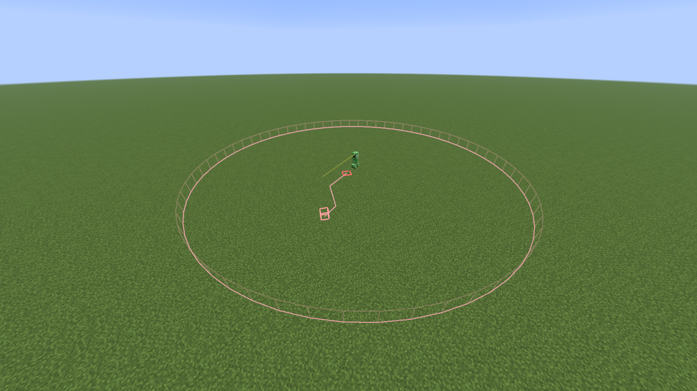

# Mob Tracing

This is a client-side Fabric and NeoForge mod (1.21.4) that makes mob AI and pathfinding visible in real-time.

## Features

- Mob Paths - Shows what path each nearby mob is currently navigating.
- Target Lines - Shows what a hostile mob is attacking if they are attacking a player.
- Look Direction - shows what direction each mob is currently facing.
- Aggro Radius - shows the distance each mob can follow and detect players.
- HUD Overlay - Shows which current AI Goal and Status each mob is pursuing.

## Controls

- F7 - Toggle overlay On and Off

## Installation

1. Install fabric loader or neoforge with Minecraft 1.21.4.
2. Download the jar on the releases page.
3. Put the jar in your mods/ folder.
4. Run the game!

Fabric only, you must also have fabric api installed.

## Configuration

Open the configuration gui with either the mod menu (Fabric) or the mods list (NeoForge) in the game's settings menu to change any of the following:

- Max Render Distance (8 to 128 blocks)
- Label opacity
- Update Interval

## Notes

This mod functions correctly with single player and LAN games. With servers, the AI is processed on the server so it shows "Idle" as every goal and all the paths aren't visible (this is done on purpose).

## License

MIT
